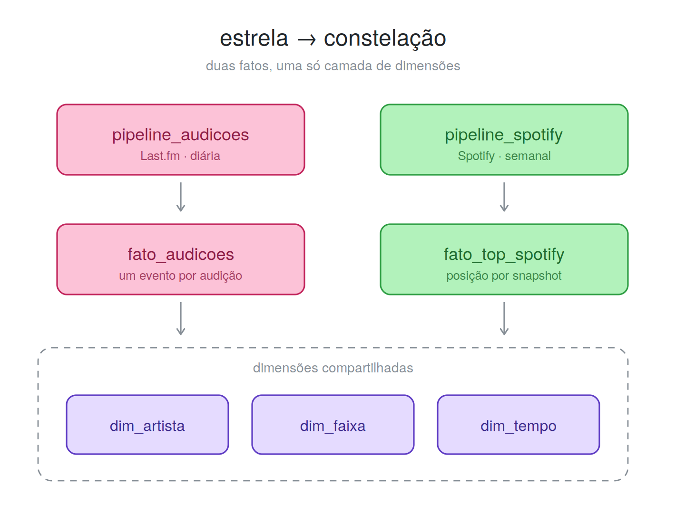

# Pipeline de Audições — Last.fm (+ Spotify) → MinIO → Airflow → PostgreSQL

Projeto de portfólio de engenharia de dados. A ideia: entender **como meu gosto
musical mudou ao longo dos anos**, transformando essa dúvida numa pipeline de dados
de ponta a ponta.

A pipeline coleta o meu histórico de músicas (**API do Last.fm**), guarda em um data
lake (**MinIO**), trata os dados e carrega em um data warehouse (**PostgreSQL**),
tudo agendado e monitorado pelo **Apache Airflow**. Segue a arquitetura medalhão
(bronze → prata → ouro). O **Spotify** entra como segunda fonte (fase 2b), enriquecendo
as dimensões via OAuth.

> **Status:** ✅ completo e rodando. **Duas** pipelines no Airflow — Last.fm (`pipeline_audicoes`, `@daily`) e Spotify (`pipeline_spotify`, `@weekly`) — ambas bronze → prata → ouro. O histórico completo do Last.fm (~6 anos) está no warehouse, o Spotify enriquece as dimensões, e o **esquema constelação** (duas fatos sobre dimensões compartilhadas) responde a pergunta que cruza as duas fontes.
> O código de cada etapa foi escrito missão a missão, seguindo um roteiro de estudo — as 19 estão fechadas.

## Arquitetura

```
Last.fm API ─┐
(scrobbles)  │     MinIO (data lake)                  PostgreSQL (warehouse)
             ├──►  raw/        (JSON cru, bronze)
             └──►  processed/  (Parquet, prata)  ───►  analytics (ouro)
Spotify API ─────►  (mesmo caminho bronze→prata→ouro)  fato_audicoes + fato_top_spotify
(top + biblioteca, via OAuth)                          sobre dim_artista e dim_faixa
                                                       (+ dim_tempo, só do Last.fm)

        (tudo agendado, executado e monitorado pelo Airflow:
         pipeline_audicoes @daily · pipeline_spotify @weekly)
```

Diagrama completo em [`docs/arquitetura.jpg`](docs/arquitetura.jpg).

## O que já roda

Uma DAG do Airflow (`pipeline_audicoes`) executa a pipeline inteira de ponta a ponta, em sequência — `descobrir_marca_dagua → extrair → transformar → carregar → validar`, todas as tasks verdes numa mesma execução:

- ✅ **Ingestão (bronze)** — puxa meu histórico do Last.fm e grava o JSON cru no data lake (MinIO), no horário agendado. A carga é **incremental**: uma task pergunta ao warehouse qual o scrobble mais recente já carregado (a *marca d'água*) e a extração busca só o que veio depois, paginando quando a janela é grande. Cada execução escreve numa pasta própria — o bronze nunca é sobrescrito.
- ✅ **Transformação (prata)** — lê o JSON cru, limpa com pandas (descarta o `nowplaying`, tipa e deduplica) e salva em Parquet.
- ✅ **Carga (ouro)** — modela um esquema estrela (`fato_audicoes` + dimensões) e carrega no data warehouse PostgreSQL, de forma idempotente.

Além da ingestão do dia a dia (a DAG), a **carga histórica completa** (`backfill.py`) já povoou o warehouse com ~6 anos de audições — a base para as análises.

- ✅ **Análise (ouro)** — o esquema estrela responde a pergunta que originou o projeto: *"qual foi meu artista mais ouvido em cada mês"* — `fato_audicoes` × `dim_faixa` × `dim_artista` × `dim_tempo`, uma linha por mês ao longo dos anos. A consulta está em [`db/consultas/artista_por_mes.sql`](db/consultas/artista_por_mes.sql).

**Segunda fonte — Spotify (via OAuth).** Uma segunda DAG (`pipeline_spotify`, semanal) traz meus *tops* e minha biblioteca do Spotify pelo mesmo caminho bronze → prata → ouro. No warehouse, isso vira um **esquema constelação**: uma nova fato (`fato_top_spotify`) que compartilha com a `fato_audicoes` as dimensões de artista e de faixa, além de enriquecer artistas e faixas com os ids do Spotify — casando as duas fontes **por nome**. O token OAuth roda sozinho dentro do container (sem navegador), reutilizando o *refresh token* em cache.

- ✅ **O cruzamento entre as fontes (ouro)** — a constelação responde o que nenhuma das duas fatos responderia sozinha: o *top computado* pelo Spotify ao lado do *mais tocado* de verdade, na mesma janela de tempo. São duas consultas, porque são duas perguntas: [`cruzamento_lastfm_spotify.sql`](db/consultas/cruzamento_lastfm_spotify.sql) pergunta se o top se sustenta nas execuções (recortado no top 20, cabe numa tela) e [`cruzamento_completo.sql`](db/consultas/cruzamento_completo.sql) pergunta onde as duas discordam nos dois sentidos (`FULL OUTER`, sem recorte). As duas fontes concordam no topo e divergem conforme desce — e a `fato_top_spotify` guarda uma série histórica que a própria API do Spotify não guarda, porque ela só devolve o "top de agora".



- ✅ **Testes** — a transformação da prata vive em `dags/transformacoes.py`, separada do I/O, e é coberta por testes que rodam em segundos sem subir Airflow, MinIO ou Postgres (`pytest`, a partir da raiz). Eles cobrem o que a API tem de escorregadio: o `track` que vem como objeto quando a página traz um resultado só, o "tocando agora" que chega sem data, e a deduplicação por (instante, faixa).
- ✅ **Qualidade e alerta** — cada DAG termina numa task de **validação**: um punhado de perguntas sobre o que acabou de entrar (chave estrangeira órfã, dimensão duplicada, linha da prata que não chegou ao ouro) que precisam responder zero. Reprovou, a task fica vermelha e chega um **aviso por webhook** — só depois de esgotar as tentativas, para que falha que o retry resolve não vire barulho.

## Documentação

- [`docs/PRD_Pipeline_Audicoes.md`](docs/PRD_Pipeline_Audicoes.md) — o PRD completo (escopo, fontes, modelo de dados, DAGs, riscos). A partir da v0.3 ele descreve a pipeline *as-built*, e a **§9.1 lista as limitações conhecidas** — o que o projeto não faz, por escolha ou por limite da fonte.

## Estrutura do projeto

```
dags/        as duas DAGs do Airflow (+ transformação, validações e alerta) — é isto que roda
tests/       testes da transformação (pytest, sem subir nada)
lastfm/      utilitário de host: ler o Parquet da prata
spotify/     utilitário de host: conferir o OAuth listando os top tracks
db/          schema.sql (esquema do warehouse) + migracoes/ + consultas/ (as queries analíticas)
scripts/     backfill.py (carga histórica) + reparar_dimensoes.py (reparo pontual)
arquivo/     código aposentado, mantido como registro das missões
docs/        PRD e documentação
```

> **O que roda no Airflow são as DAGs em `dags/`.** A lógica de cada etapa vive inline nelas.
> `lastfm/` e `spotify/` guardam só utilitários que se roda à mão; as versões de cada etapa,
> escritas missão a missão, foram para `arquivo/` quando pararam de refletir o que a DAG faz —
> código aposentado é registro, não deve passar por estado atual.

> Os scripts são rodados a partir da **raiz** do projeto (ex.: `python spotify/test_spotify.py`).

## Pré-requisitos

- Docker + Docker Compose
- Python 3.11+ (o `requirements.txt` fixa `pandas==3.0`, que não instala no 3.10)
- Conta no Last.fm + API key (grátis): https://www.last.fm/api/account/create
- *(opcional, fase 2b)* App no [Spotify for Developers](https://developer.spotify.com/dashboard) — client id/secret + `redirect_uri` para o OAuth

## Como começar

```bash
python3 -m venv .venv
source .venv/bin/activate          # Windows: .venv\Scripts\activate
pip install -r requirements.txt

cp .env.example .env               # e preencha LASTFM_API_KEY e LASTFM_USER

docker compose up airflow-init     # 1ª vez: inicializa o banco de metadados do Airflow
docker compose up -d               # sobe tudo: Airflow + MinIO + Postgres + warehouse + Redis
```

Na primeira subida o compose também prepara o que a pipeline espera encontrar, sem passo manual:

- **os buckets `raw` e `processed`** no MinIO (serviço `minio-init`, que roda uma vez e encerra);
- **as tabelas do warehouse**, aplicando [`db/schema.sql`](db/schema.sql) — o PostgreSQL executa esse arquivo apenas quando o volume de dados está vazio, ou seja, só na criação. Num warehouse já povoado ele é ignorado, e mudança de schema com dado dentro pede `ALTER TABLE`.

Serviços no ar:

- **Airflow** — http://localhost:8080 (`airflow` / `airflow`)
- **MinIO** (console do data lake) — http://localhost:9001 (`minioadmin` / `minioadmin`)
- **PostgreSQL** (warehouse, camada ouro) — `localhost:5433` (`warehouse` / `warehouse`, banco `warehouse`)

### 1º — a carga histórica (obrigatória, uma vez)

```bash
python scripts/backfill.py
```

Ele pagina todo o histórico do Last.fm, grava cada página no bronze e faz a carga em lote no warehouse.

**Este passo vem antes da DAG, não depois.** A ingestão diária é incremental: ela começa perguntando ao warehouse qual o scrobble mais recente já carregado, e com a `fato_audicoes` vazia não há resposta — a primeira task falha de propósito, com uma mensagem pedindo o backfill. É uma decisão de desenho: melhor falhar dizendo o que falta do que ingerir silenciosamente uma janela arbitrária.

É uma operação pontual e demorada (~305 chamadas à API, dezenas de minutos). A DAG cuida do dia a dia daí em diante.

### 2º — a pipeline diária

No Airflow, ative a DAG **`pipeline_audicoes`** e clique em *Trigger* ▶️. Ela executa `descobrir_marca_dagua → extrair → transformar → carregar → validar` — a ingestão é **incremental**: cada execução pergunta ao warehouse até onde já carregou e busca só o que falta, paginando se for muito. Se não houver nada novo, as tasks são puladas em vez de falhar.

### 3º (opcional) — a esteira do Spotify

A segunda DAG, **`pipeline_spotify`** (`@weekly`), faz o mesmo caminho para o Spotify — enriquecendo as dimensões e populando a `fato_top_spotify`. Ela requer as credenciais OAuth do Spotify no `.env` e a primeira autenticação feita localmente (o token fica em cache e é reaproveitado pelo container).

## Roteiro (casado com as fases do guia)

- [x] Missão 0 — Esqueleto do projeto, Git e venv
- [x] Missão 1 — Conversar com a API do Last.fm
- [x] Missão 2 — Guardar o dado cru (bronze, local)
- [x] Missão 3 — Subir o data lake (Docker + MinIO)
- [x] Missão 4 — Colocar o dado dentro do lake (ingestão)
- [x] Missão 5 — Preparar a extração para virar uma tarefa
- [x] Missão 6 — Subir o Airflow
- [x] Missão 7 — A DAG: ingestão orquestrada
- [x] Missão 8 — Deixar apresentável e publicar

**Fase 2 — do lake ao warehouse (prata e ouro):**

- [x] Missão 9 — Transformação: JSON cru → Parquet limpo (prata)
- [x] Missão 10 — Carga: esquema estrela no PostgreSQL (ouro)
- [x] Missão 11 — A DAG de ponta a ponta (extrair → transformar → carregar)
- [x] Missão 12 — A primeira query analítica ("artista mais ouvido por mês")
**Fase 2b (opcional) — Spotify: segunda fonte, enriquecendo as dimensões via OAuth:**

- [x] Missão 13 — O app do Spotify e o primeiro OAuth (autenticar → top tracks no terminal)
- [x] Missão 14 — Extrair → `raw`: top tracks/artists (3 time_ranges) + biblioteca salva (bronze)
- [x] Missão 15 — Transformar → `processed`: JSON do Spotify → Parquet limpo (prata)
- [x] Missão 16 — Enriquecer as dimensões + `fato_top_spotify`: esquema constelação (ouro)
- [x] Missão 17 — A DAG `pipeline_spotify` (`@weekly`)
- [x] Missão 18 — A query cruzada Last.fm × Spotify (top computado vs mais tocado)
